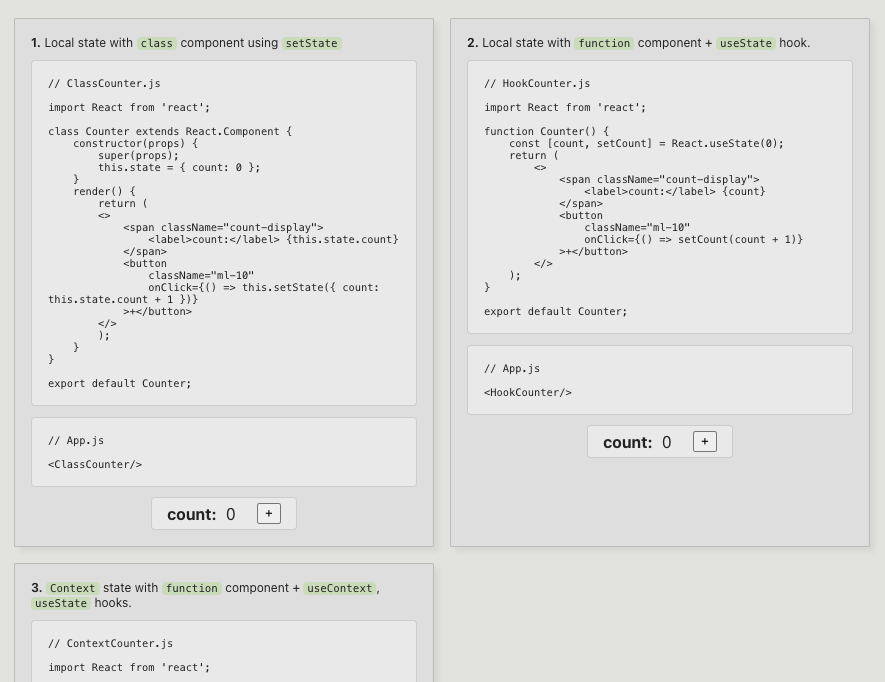

# React state comparison
Comparing options for state management in **React** including class component state, function component state, using hooks and context, and integration with state containers. 

### Development

Run the React development server `npm start`. http://localhost:3000 \
Run the production build locally `npm run build`

### Production

This application is deployed to [GitHub Pages](https://docs.github.com/en/pages/getting-started-with-github-pages/about-github-pages) using a GitHub Actions [workflow](https://github.com/bburrier/react-state-comparison/blob/master/.github/workflows/cd.yml).

**live**: https://bburrier.github.io/react-state-comparison/
